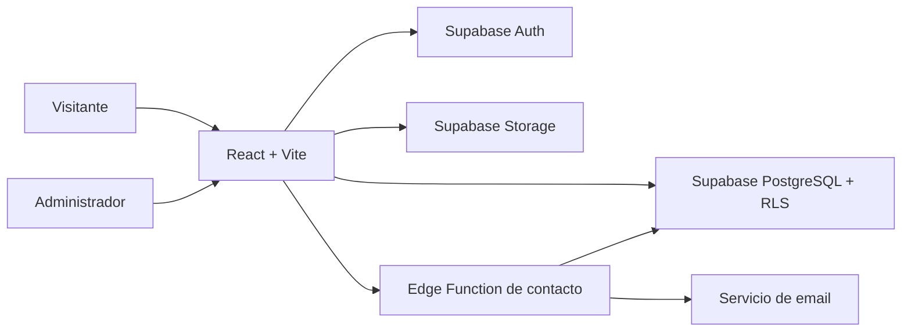

# Arquitectura

## Objetivo

Zunino Remates Web publica próximos remates presenciales, catálogos y datos de la
empresa. También ofrece un panel para preparar, revisar y publicar contenido.

## Estado actual

La aplicación es una SPA desarrollada con React y Vite.

- La web pública lee datos desde un contexto compartido.
- El panel modifica esos mismos datos.
- La persistencia actual utiliza `localStorage`.
- El acceso administrativo actual utiliza credenciales incluidas en el frontend.
- Los PDFs e imágenes de demostración están en `public/`.

Esta solución permite desarrollar y probar el flujo, pero no es apta para
producción.

## Arquitectura objetivo



Supabase será responsable de:

- Autenticar administradores.
- Persistir remates y contenido general.
- Aplicar permisos mediante Row Level Security.
- Guardar catálogos e imágenes.
- Registrar consultas y auditoría.

El navegador utilizará únicamente la clave publicable. Las operaciones sensibles
y secretos permanecerán del lado servidor.

## Rutas principales

| Ruta | Función |
| --- | --- |
| `/` | Inicio, remates, catálogos, empresa y contacto |
| `/remates/:slug` | Información completa de un remate publicado |
| `/admin12345` | Panel administrativo |

En producción, el hosting debe enviar las rutas desconocidas a `index.html` para
que React Router las resuelva.

## Flujo de un remate

```text
borrador → en_revision → publicado → finalizado
                           └───────→ cancelado
```

- `borrador`: permite información incompleta.
- `en_revision`: carga preparada para ser verificada.
- `publicado`: visible en la web pública.
- `finalizado`: evento cerrado y retirado de próximos remates.
- `cancelado`: evento suspendido.

La publicación requiere título, fechas, ubicación, descripciones, catálogo PDF,
al menos un requisito y al menos una condición. El frontend valida el formulario
y PostgreSQL volverá a validar la transición.

## Organización del código

- `src/pages`: composición de cada ruta.
- `src/components`: interfaz reutilizable.
- `src/context`: acceso y modificación de datos.
- `src/data`: contenido inicial y transformaciones.
- `src/admin`: configuración y reglas de publicación.
- `src/types`: contratos TypeScript.
- `supabase`: esquema de base, RLS, Storage y documentación.

Al conectar Supabase, la interfaz pública debería cambiar lo mínimo posible. La
capa de contexto será reemplazada por un repositorio o servicio que consulte la
API.

## Modelo de datos

El detalle de tablas, relaciones y políticas está en:

- [`supabase/SCHEMA.md`](../supabase/SCHEMA.md)
- [`supabase/Zunino-Remates-ER.drawio`](../supabase/Zunino-Remates-ER.drawio)
- [`supabase/migrations`](../supabase/migrations)

