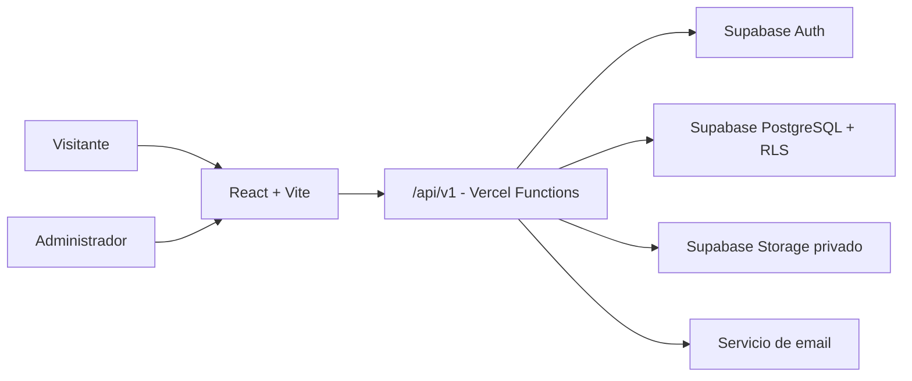

# Arquitectura

## Objetivo

Zunino Remates Web publica próximos remates presenciales, catálogos y datos de la
empresa. También ofrece un panel para preparar, revisar y publicar contenido.

## Estado actual

La aplicación es una SPA desarrollada con React y Vite.

- React consume contratos explícitos desde `/api/v1/*`.
- La API de Vercel autentica contra Supabase y entrega una cookie cifrada.
- PostgreSQL persiste remates y contenido, con RLS y control de versiones.
- Storage privado guarda lotes y la API entrega URLs firmadas temporales.
- El proveedor local se conserva únicamente para pruebas y la rama `main` actual.

## Arquitectura objetivo



Supabase es responsable de:

- Autenticar administradores.
- Persistir remates y contenido general.
- Aplicar permisos mediante Row Level Security.
- Guardar imágenes de lotes.
- Registrar consultas y auditoría.

El navegador consumirá solamente la API del mismo origen y no recibirá claves,
tokens, nombres de tablas ni rutas internas de Storage. La API utilizará la
identidad del usuario administrativo al consultar PostgreSQL para conservar RLS
como autorización definitiva. El CRUD habitual no utilizará `service_role`.

La decisión completa, incluyendo sesiones, entornos y rollback, está en
[`ADR-0001`](adr/0001-bff-vercel-supabase.md).

## Rutas principales

| Ruta | Función |
| --- | --- |
| `/` | Inicio, remates, catálogos, empresa y contacto |
| `/remates/:slug` | Información completa de un remate publicado |
| `/admin12345` | Panel administrativo |

En producción, el hosting debe enviar las rutas desconocidas a `index.html` para
que React Router las resuelva.

## Flujo de un remate

```text
borrador ↔ en_revision → publicado ↔ oculto
                           ├──────→ finalizado
                           └──────→ cancelado
```

- `borrador`: permite información incompleta.
- `en_revision`: carga preparada para ser verificada.
- `publicado`: visible en la web pública.
- `oculto`: retirado temporalmente, conserva su URL y puede volver a publicarse.
- `finalizado`: evento cerrado y retirado de próximos remates.
- `cancelado`: evento suspendido.

La publicación requiere título, una fecha concreta o el estado `Fecha a confirmar`,
ubicación, descripciones, información del catálogo, al menos un requisito y al
menos una condición. El frontend valida el formulario y PostgreSQL volverá a
validar la transición.

La fecha se conserva como un instante real y se presenta en
`America/Montevideo`. El slug se regenera en borrador y revisión, pero queda fijo
desde la primera publicación. Las actualizaciones utilizan una versión numérica
para detectar ediciones simultáneas antes de sobrescribir datos.

## Organización del código

- `src/pages`: composición de cada ruta.
- `src/components`: interfaz reutilizable.
- `src/context`: acceso y modificación de datos.
- `src/data`: contenido inicial y transformaciones.
- `src/admin`: configuración y reglas de publicación.
- `src/types`: contratos TypeScript.
- `supabase`: esquema de base, RLS, Storage y documentación.

La capa de contexto mantiene separadas las fuentes pública y administrativa, y
ambas consultan DTO explícitos de la API sin acoplar React al esquema físico.

## Modelo de datos

El detalle de tablas, relaciones y políticas está en:

- [`supabase/SCHEMA.md`](../supabase/SCHEMA.md)
- [`supabase/Zunino-Remates-ER.drawio`](../supabase/Zunino-Remates-ER.drawio)
- [`supabase/migrations`](../supabase/migrations)
