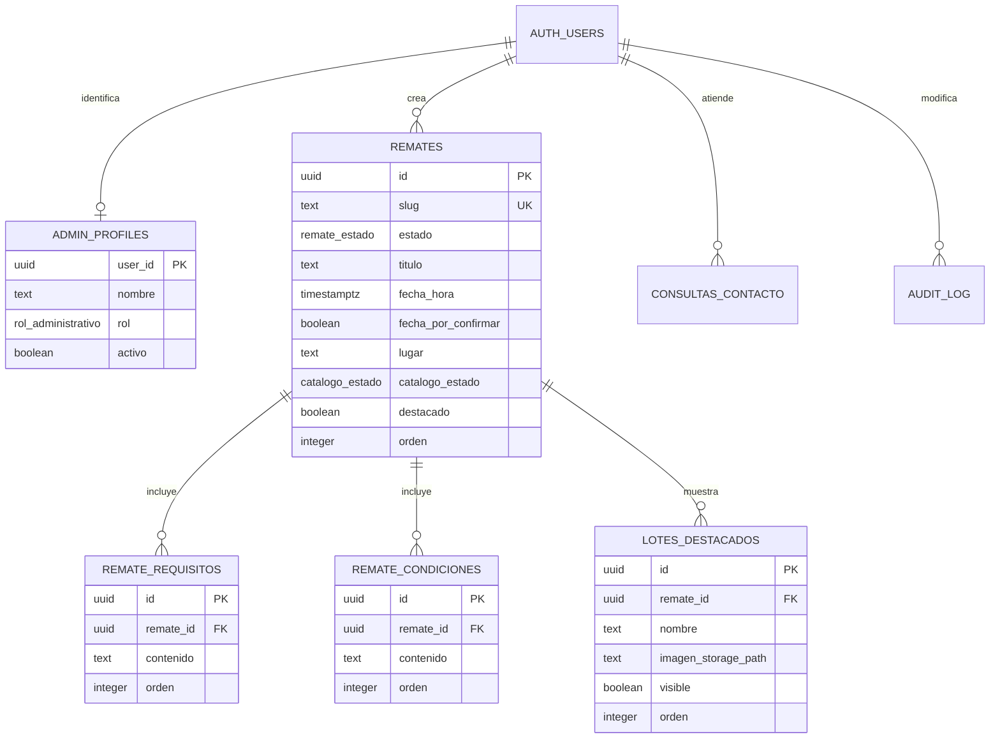

# Modelo de datos

La versión editable y visual de este modelo está en
`Zunino-Remates-ER.drawio`.

## Acceso público

Los visitantes solamente pueden leer:

- Remates con estado `publicado`.
- Requisitos, condiciones y lotes de remates publicados.
- Preguntas frecuentes y pasos marcados como visibles.
- La configuración pública del sitio.

No pueden listar borradores, consultar mensajes de contacto ni leer auditoría.

## Acceso administrativo

Las políticas consultan `admin_profiles` mediante funciones protegidas:

- `is_active_admin()`: administradores y editores activos.
- `is_full_admin()`: únicamente administradores activos.

La autorización no depende de metadatos editables por el usuario ni de ocultar la
ruta del panel.

La matriz detallada de operaciones permitidas está en
[`ACCESS_CONTROL.md`](ACCESS_CONTROL.md).

## Decisiones de diseño

- Las imágenes no se guardan en PostgreSQL; solo se registra su ruta de Storage.
- Los buckets son privados y RLS habilita archivos solo para remates publicados.
- Requisitos y condiciones están normalizados para poder ordenarlos y editarlos.
- Los lotes destacados son opcionales.
- Solo puede existir un remate publicado marcado como destacado.
- Las consultas públicas entrarán mediante una Edge Function.
- Los cambios administrativos importantes quedan registrados en `audit_log`.
- Solo los administradores pueden leer la auditoría; editores y visitantes no
  tienen acceso.
- La auditoría de consultas excluye los campos con datos personales y notas
  internas.
- La fila de configuración principal se actualiza, pero no puede crearse ni
  eliminarse desde la aplicación.
- Los datos originales de una consulta de contacto son inmutables; el equipo
  solo modifica su seguimiento.
- Una protección transaccional impide dejar el sistema sin administradores
  activos.
